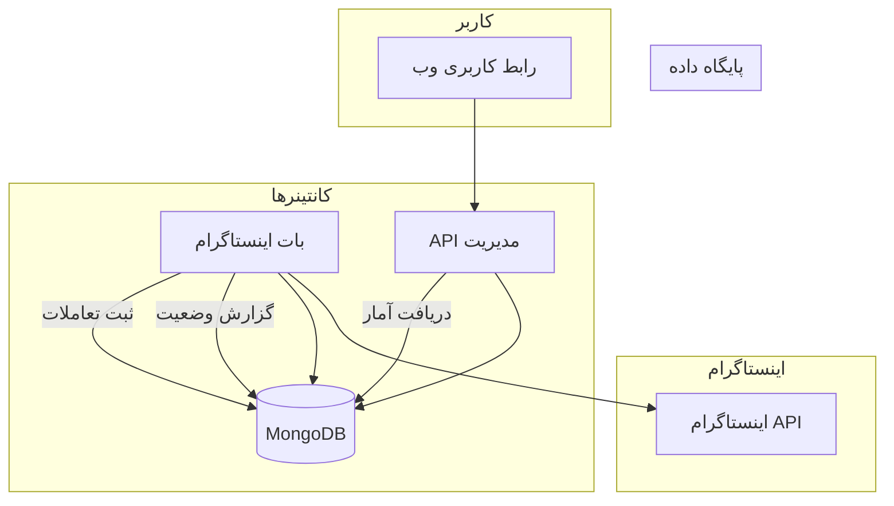
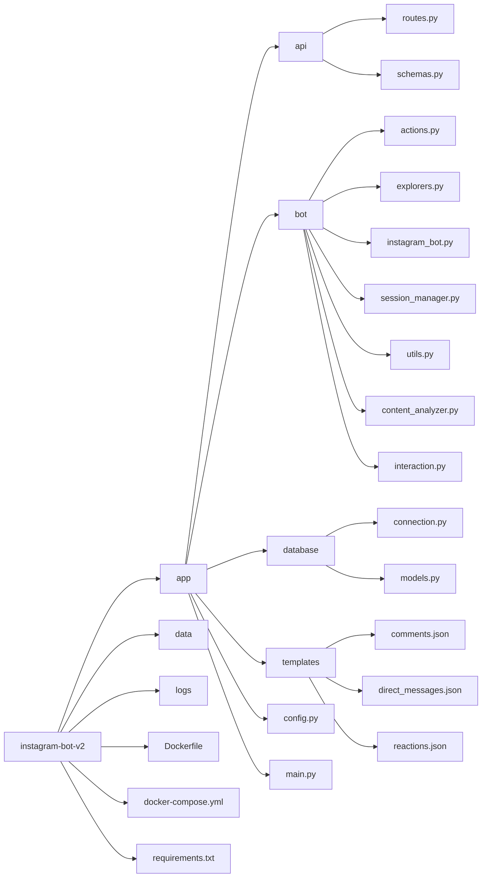
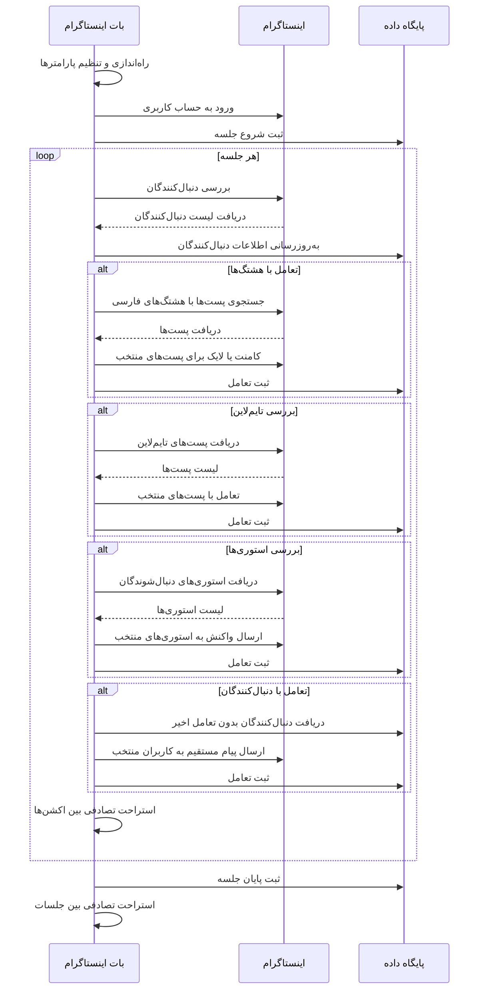
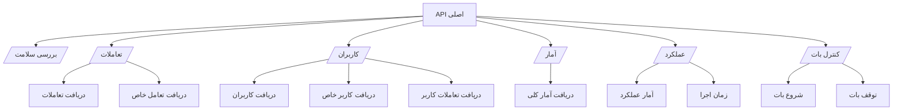
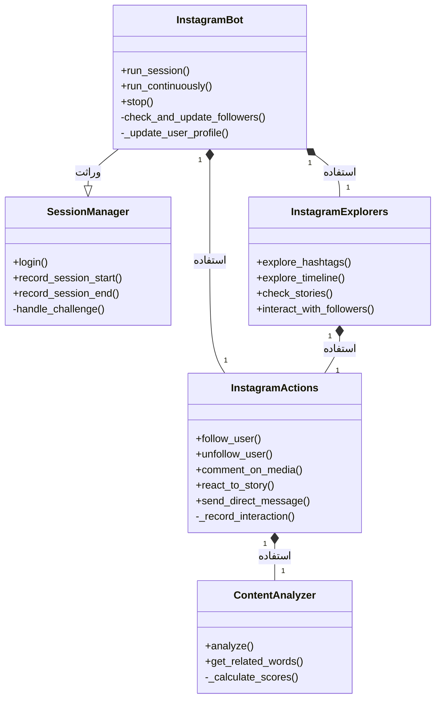
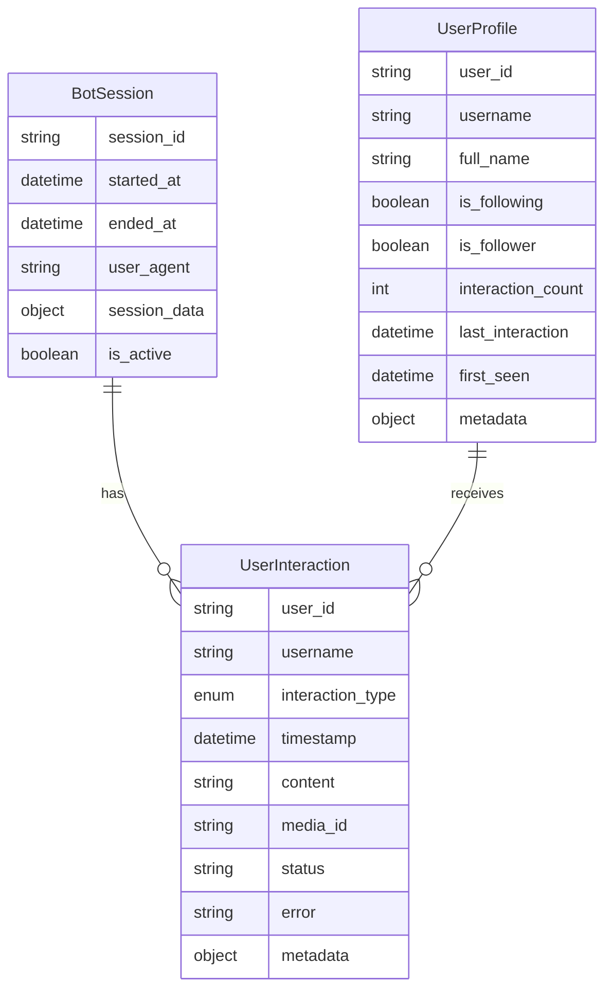

# بات اینستاگرام نسخه 2

بات اینستاگرام نسخه 2 یک ابزار هوشمند برای تعامل خودکار با کاربران اینستاگرام است که می‌تواند به صورت هوشمند فعالیت‌هایی مانند کامنت‌گذاری، لایک، فالو و آنفالو، واکنش به استوری‌ها و ارسال پیام‌های مستقیم را مدیریت کند. این بات همچنین دارای یک رابط API است که به شما امکان می‌دهد عملکرد بات را نظارت کرده و گزارش‌های دقیقی از فعالیت‌های آن دریافت کنید.

## ویژگی‌های اصلی

- **تعامل هوشمند**: تعامل هوشمند با پست‌ها، استوری‌ها و کاربران اینستاگرام
- **تشخیص محتوای فارسی**: اولویت‌دهی به محتواهای فارسی برای تعامل
- **مدیریت دنبال‌کنندگان**: مدیریت خودکار فالو و آنفالو
- **رفتار انسان‌گونه**: شبیه‌سازی رفتار انسانی با استراحت‌های تصادفی
- **داشبورد مدیریت**: API کامل برای نظارت و مدیریت عملکرد بات
- **ذخیره‌سازی مستمر**: ثبت و ذخیره تمامی فعالیت‌ها در پایگاه داده
- **تحلیل محتوا**: تشخیص خودکار موضوع محتوا برای ارسال کامنت‌های مرتبط

## معماری سیستم



## ساختار پروژه



## گردش کار بات



## معماری API



## راه‌اندازی

### پیش‌نیازها

- Docker و Docker Compose
- دسترسی به اینترنت
- حساب کاربری اینستاگرام
- Python 3.9+ (برای اجرا بدون داکر)

### نصب و راه‌اندازی

1. کلون کردن مخزن:

```bash
git clone https://github.com/username/instagram-bot-v2.git
cd instagram-bot-v2
```

2. ایجاد فایل `.env` با مقادیر مناسب:

```
INSTAGRAM_USERNAME=your_instagram_username
INSTAGRAM_PASSWORD=your_instagram_password
MONGO_URI=mongodb://mongodb:27017/
MONGO_DB=instagram_bot
API_PORT=8000
```

3. راه‌اندازی با Docker Compose:

```bash
docker-compose up -d
```

این دستور سه سرویس را راه‌اندازی می‌کند:
- MongoDB: پایگاه داده
- Instagram Bot: بات اصلی
- API: رابط مدیریت

## رابط API

API بر روی پورت مشخص شده در فایل `.env` (پیش‌فرض: 8000) در دسترس خواهد بود:

```
http://localhost:8000
```

### نقاط پایانی مهم

- `/`: بررسی سلامت API
- `/interactions/`: دریافت تعاملات انجام شده
- `/users/`: دریافت لیست کاربران
- `/stats`: دریافت آمار کلی بات
- `/performance/stats`: دریافت آمار عملکرد بات
- `/performance/runtime`: دریافت اطلاعات زمان اجرای بات
- `/bot/start`: شروع بات
- `/bot/stop`: توقف بات

## کلاس‌های اصلی



## مدل‌های داده



## تنظیمات و پیکربندی

تنظیمات اصلی بات در فایل `app/config.py` قرار دارد:

- `INSTAGRAM_USERNAME` و `INSTAGRAM_PASSWORD`: اطلاعات ورود به حساب اینستاگرام
- `DAILY_INTERACTION_LIMIT`: محدودیت تعداد تعاملات روزانه
- `COMMENT_PROBABILITY`، `REACTION_PROBABILITY`، `DM_PROBABILITY`: احتمال انجام انواع تعامل
- `MIN_ACTION_INTERVAL` و `MAX_ACTION_INTERVAL`: محدوده زمانی استراحت بین اکشن‌ها
- `MIN_SESSION_DURATION` و `MAX_SESSION_DURATION`: محدوده زمانی طول هر جلسه
- `PERSIAN_HASHTAGS`: لیست هشتگ‌های فارسی مورد استفاده

## ایمنی و امنیت

- بات با رفتاری انسانی و استراحت‌های تصادفی، از محدودیت‌های اینستاگرام جلوگیری می‌کند
- سیستم مدیریت چالش‌های امنیتی اینستاگرام وجود دارد
- محدودیت تعداد تعاملات ساعتی و روزانه برای جلوگیری از شناسایی بات
- ذخیره‌سازی نشست برای بازیابی سریع در صورت قطع اتصال
- تلاش مجدد هوشمند در صورت برخورد با خطا

## لاگ‌گیری

لاگ‌های سیستم در پوشه `logs` ذخیره می‌شوند:
- لاگ‌های روزانه: `logs/instagram_bot_YYYY-MM-DD.log`
- لاگ‌های خطا: `logs/errors_YYYY-MM-DD.log`

## توسعه و مشارکت

برای توسعه این پروژه:

1. ابتدا مخزن را فورک کنید
2. یک شاخه جدید برای قابلیت یا رفع باگ ایجاد کنید
3. تغییرات خود را اعمال کنید
4. درخواست ادغام (Pull Request) ارسال کنید

## ملاحظات قانونی

استفاده از بات‌ها برای تعامل خودکار با اینستاگرام ممکن است برخلاف شرایط و قوانین استفاده از اینستاگرام باشد. مسئولیت استفاده از این بات بر عهده کاربر است.

## خطایابی و رفع مشکلات

در صورت برخورد با مشکل:

1. لاگ‌های سیستم را بررسی کنید
2. اطمینان حاصل کنید MongoDB در دسترس است
3. اطمینان حاصل کنید اطلاعات ورود اینستاگرام صحیح است
4. اینترنت و دسترسی به API اینستاگرام را بررسی کنید
5. از تست شبکه با اجرای `python -m app.network_test` استفاده کنید

## پشتیبانی و ارتباط

برای گزارش مشکلات، از بخش Issues در GitHub استفاده کنید یا به آدرس ایمیل arashzich1992@gmail.com پیام ارسال کنید.