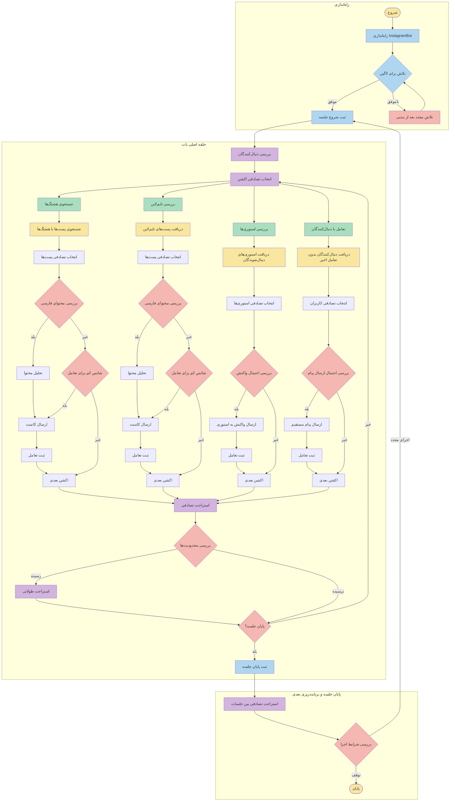

```mermaid
flowchart TD
    subgraph "راه‌اندازی"
        START([شروع]) --> INIT[راه‌اندازی InstagramBot]
        INIT --> LOGIN{تلاش برای لاگین}
        LOGIN -- موفق --> SESSION_START[ثبت شروع جلسه]
        LOGIN -- ناموفق --> RETRY[تلاش مجدد بعد از مدتی]
        RETRY --> LOGIN
    end
    
    subgraph "حلقه اصلی بات"
        SESSION_START --> CHECK_FOLLOWERS[بررسی دنبال‌کنندگان]
        CHECK_FOLLOWERS --> SELECT_ACTION[انتخاب تصادفی اکشن]
        
        SELECT_ACTION --> HASHTAGS[جستجوی هشتگ‌ها]
        SELECT_ACTION --> TIMELINE[بررسی تایم‌لاین]
        SELECT_ACTION --> STORIES[بررسی استوری‌ها]
        SELECT_ACTION --> INTERACT_FOLLOWERS[تعامل با دنبال‌کنندگان]
        
        HASHTAGS --> SEARCH_HASHTAGS[جستجوی پست‌ها با هشتگ‌ها]
        SEARCH_HASHTAGS --> SELECT_POSTS_H[انتخاب تصادفی پست‌ها]
        SELECT_POSTS_H --> CHECK_PERSIAN_H{بررسی محتوای فارسی}
        CHECK_PERSIAN_H -- بله --> ANALYZE_CONTENT_H[تحلیل محتوا]
        ANALYZE_CONTENT_H --> COMMENT_H[ارسال کامنت]
        COMMENT_H --> RECORD_INTERACTION_H[ثبت تعامل]
        CHECK_PERSIAN_H -- خیر --> RANDOM_CHANCE_H{شانس کم برای تعامل}
        RANDOM_CHANCE_H -- بله --> COMMENT_H
        RANDOM_CHANCE_H -- خیر --> NEXT_ACTION_H[اکشن بعدی]
        RECORD_INTERACTION_H --> NEXT_ACTION_H
        
        TIMELINE --> GET_FEED[دریافت پست‌های تایم‌لاین]
        GET_FEED --> SELECT_POSTS_T[انتخاب تصادفی پست‌ها]
        SELECT_POSTS_T --> CHECK_PERSIAN_T{بررسی محتوای فارسی}
        CHECK_PERSIAN_T -- بله --> ANALYZE_CONTENT_T[تحلیل محتوا]
        ANALYZE_CONTENT_T --> COMMENT_T[ارسال کامنت]
        COMMENT_T --> RECORD_INTERACTION_T[ثبت تعامل]
        CHECK_PERSIAN_T -- خیر --> RANDOM_CHANCE_T{شانس کم برای تعامل}
        RANDOM_CHANCE_T -- بله --> COMMENT_T
        RANDOM_CHANCE_T -- خیر --> NEXT_ACTION_T[اکشن بعدی]
        RECORD_INTERACTION_T --> NEXT_ACTION_T
        
        STORIES --> GET_STORIES[دریافت استوری‌های دنبال‌شوندگان]
        GET_STORIES --> SELECT_STORIES[انتخاب تصادفی استوری‌ها]
        SELECT_STORIES --> PROBABILITY_CHECK{بررسی احتمال واکنش}
        PROBABILITY_CHECK -- بله --> REACT[ارسال واکنش به استوری]
        REACT --> RECORD_INTERACTION_S[ثبت تعامل]
        PROBABILITY_CHECK -- خیر --> NEXT_ACTION_S[اکشن بعدی]
        RECORD_INTERACTION_S --> NEXT_ACTION_S
        
        INTERACT_FOLLOWERS --> GET_FOLLOWERS[دریافت دنبال‌کنندگان بدون تعامل اخیر]
        GET_FOLLOWERS --> SELECT_FOLLOWERS[انتخاب تصادفی کاربران]
        SELECT_FOLLOWERS --> DM_PROBABILITY{بررسی احتمال ارسال پیام}
        DM_PROBABILITY -- بله --> SEND_DM[ارسال پیام مستقیم]
        SEND_DM --> RECORD_INTERACTION_F[ثبت تعامل]
        DM_PROBABILITY -- خیر --> NEXT_ACTION_F[اکشن بعدی]
        RECORD_INTERACTION_F --> NEXT_ACTION_F
        
        NEXT_ACTION_H & NEXT_ACTION_T & NEXT_ACTION_S & NEXT_ACTION_F --> SLEEP[استراحت تصادفی]
        SLEEP --> CHECK_LIMITS{بررسی محدودیت‌ها}
        CHECK_LIMITS -- رسیده --> LONG_SLEEP[استراحت طولانی]
        CHECK_LIMITS -- نرسیده --> SESSION_END_CHECK{پایان جلسه؟}
        LONG_SLEEP --> SESSION_END_CHECK
        SESSION_END_CHECK -- بله --> SESSION_END[ثبت پایان جلسه]
        SESSION_END_CHECK -- خیر --> SELECT_ACTION
    end
    
    subgraph "پایان جلسه و برنامه‌ریزی بعدی"
        SESSION_END --> RANDOM_BREAK[استراحت تصادفی بین جلسات]
        RANDOM_BREAK --> RECHECK{بررسی شرایط اجرا}
        RECHECK -- اجرای مجدد --> SESSION_START
        RECHECK -- توقف --> END([پایان])
    end
    
    style START fill:#f9e79f
    style END fill:#f9e79f
    style INIT fill:#aed6f1
    style LOGIN fill:#aed6f1
    style SESSION_START fill:#aed6f1
    style SESSION_END fill:#aed6f1
    style RETRY fill:#f5b7b1
    
    style CHECK_FOLLOWERS fill:#d2b4de
    style SELECT_ACTION fill:#d2b4de
    
    style HASHTAGS fill:#a9dfbf
    style TIMELINE fill:#a9dfbf
    style STORIES fill:#a9dfbf
    style INTERACT_FOLLOWERS fill:#a9dfbf
    
    style SEARCH_HASHTAGS fill:#f9e79f
    style GET_FEED fill:#f9e79f
    style GET_STORIES fill:#f9e79f
    style GET_FOLLOWERS fill:#f9e79f
    
    style CHECK_PERSIAN_H fill:#f5b7b1
    style CHECK_PERSIAN_T fill:#f5b7b1
    style PROBABILITY_CHECK fill:#f5b7b1
    style DM_PROBABILITY fill:#f5b7b1
    style RANDOM_CHANCE_H fill:#f5b7b1
    style RANDOM_CHANCE_T fill:#f5b7b1
    style CHECK_LIMITS fill:#f5b7b1
    style SESSION_END_CHECK fill:#f5b7b1
    style RECHECK fill:#f5b7b1
    
    style SLEEP fill:#d2b4de
    style LONG_SLEEP fill:#d2b4de
    style RANDOM_BREAK fill:#d2b4de
```