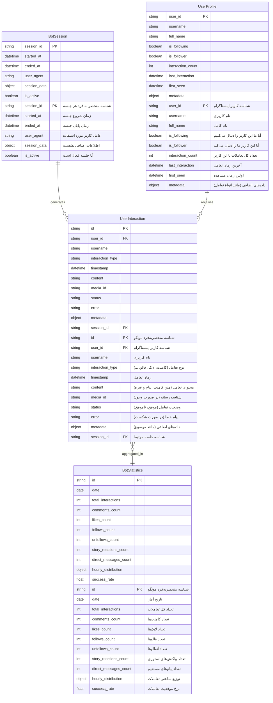

```mermaid
erDiagram
    BotSession {
        string session_id PK
        datetime started_at
        datetime ended_at
        string user_agent
        object session_data
        boolean is_active
    }
    
    UserInteraction {
        string id PK
        string user_id FK
        string username
        string interaction_type
        datetime timestamp
        string content
        string media_id
        string status
        string error
        object metadata
        string session_id FK
    }
    
    UserProfile {
        string user_id PK
        string username
        string full_name
        boolean is_following
        boolean is_follower
        int interaction_count
        datetime last_interaction
        datetime first_seen
        object metadata
    }
    
    BotStatistics {
        string id PK
        date date
        int total_interactions
        int comments_count
        int likes_count
        int follows_count
        int unfollows_count
        int story_reactions_count
        int direct_messages_count
        object hourly_distribution
        float success_rate
    }
    
    BotSession ||--o{ UserInteraction : "generates"
    UserProfile ||--o{ UserInteraction : "receives"
    UserInteraction }o--|| BotStatistics : "aggregated_in"
    
    BotSession {
        string session_id PK "شناسه منحصر به فرد هر جلسه"
        datetime started_at "زمان شروع جلسه"
        datetime ended_at "زمان پایان جلسه"
        string user_agent "عامل کاربر مورد استفاده"
        object session_data "اطلاعات اضافی نشست"
        boolean is_active "آیا جلسه فعال است"
    }
    
    UserInteraction {
        string id PK "شناسه منحصربه‌فرد مونگو"
        string user_id FK "شناسه کاربر اینستاگرام"
        string username "نام کاربری"
        string interaction_type "نوع تعامل (کامنت، لایک، فالو، ...)"
        datetime timestamp "زمان تعامل"
        string content "محتوای تعامل (متن کامنت، پیام و غیره)"
        string media_id "شناسه رسانه (در صورت وجود)"
        string status "وضعیت تعامل (موفق، ناموفق)"
        string error "پیام خطا (در صورت شکست)"
        object metadata "داده‌های اضافی (مانند موضوع)"
        string session_id FK "شناسه جلسه مرتبط"
    }
    
    UserProfile {
        string user_id PK "شناسه کاربر اینستاگرام"
        string username "نام کاربری"
        string full_name "نام کامل"
        boolean is_following "آیا ما این کاربر را دنبال می‌کنیم"
        boolean is_follower "آیا این کاربر ما را دنبال می‌کند"
        int interaction_count "تعداد کل تعاملات با این کاربر"
        datetime last_interaction "آخرین زمان تعامل"
        datetime first_seen "اولین زمان مشاهده"
        object metadata "داده‌های اضافی (مانند انواع تعامل)"
    }
    
    BotStatistics {
        string id PK "شناسه منحصربه‌فرد مونگو"
        date date "تاریخ آمار"
        int total_interactions "تعداد کل تعاملات"
        int comments_count "تعداد کامنت‌ها"
        int likes_count "تعداد لایک‌ها"
        int follows_count "تعداد فالوها"
        int unfollows_count "تعداد آنفالوها"
        int story_reactions_count "تعداد واکنش‌های استوری"
        int direct_messages_count "تعداد پیام‌های مستقیم"
        object hourly_distribution "توزیع ساعتی تعاملات"
        float success_rate "نرخ موفقیت تعاملات"
    }
```