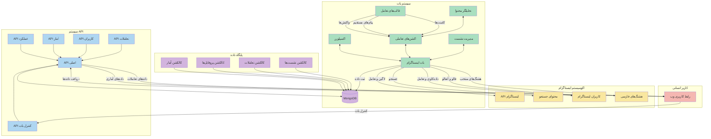

```mermaid
graph TD
    subgraph "اکوسیستم اینستاگرام"
        IG[API اینستاگرام]
        EXPLORE[محتوای جستجو]
        USERS[کاربران اینستاگرام]
        HASHTAGS[هشتگ‌های فارسی]
    end
    
    subgraph "سیستم بات"
        BOT[بات اینستاگرام] -->|لاگین و تعامل| IG
        BOT -->|جستجو| EXPLORE
        BOT -->|هشتگ‌های منتخب| HASHTAGS
        BOT -->|فالو و آنفالو| USERS
        
        BOT -->|داده‌کاوی و تعامل| USERS
        
        SM[مدیریت نشست] <--> BOT
        
        ACT[اکشن‌های تعاملی] <--> BOT
        
        CA[تحلیلگر محتوا] <--> ACT
        EXP[اکسپلورر] <--> BOT
        
        TEMPLATES[قالب‌های تعامل]
        TEMPLATES -->|کامنت‌ها| ACT
        TEMPLATES -->|پیام‌های مستقیم| ACT
        TEMPLATES -->|واکنش‌ها| ACT
        
        BOT -->|ثبت داده| DB
    end
    
    subgraph "سیستم API"
        MAIN_API[API اصلی] --> DB
        
        INTERACT_API[API تعاملات] --> MAIN_API
        USER_API[API کاربران] --> MAIN_API
        STATS_API[API آمار] --> MAIN_API
        PERF_API[API عملکرد] --> MAIN_API
        CTRL_API[API کنترل بات] --> MAIN_API
    end
    
    subgraph "پایگاه داده"
        DB[(MongoDB)]
        SESSIONS[کالکشن نشست‌ها] --> DB
        INTERACTIONS[کالکشن تعاملات] --> DB
        PROFILES[کالکشن پروفایل‌ها] --> DB
        STATISTICS[کالکشن آمار] --> DB
    end
    
    subgraph "کاربر انسانی"
        UI[رابط کاربری وب] -->|دریافت داده‌ها| MAIN_API
        UI -->|کنترل بات| CTRL_API
    end
    
    MAIN_API -->|داده‌های تعاملات| UI
    MAIN_API -->|داده‌های آماری| UI
    
    style HASHTAGS fill:#f9e79f
    style EXPLORE fill:#f9e79f
    style USERS fill:#f9e79f
    style IG fill:#f9e79f
    
    style BOT fill:#a9dfbf
    style SM fill:#a9dfbf
    style ACT fill:#a9dfbf
    style CA fill:#a9dfbf
    style EXP fill:#a9dfbf
    style TEMPLATES fill:#a9dfbf
    
    style MAIN_API fill:#aed6f1
    style INTERACT_API fill:#aed6f1
    style USER_API fill:#aed6f1
    style STATS_API fill:#aed6f1
    style PERF_API fill:#aed6f1
    style CTRL_API fill:#aed6f1
    
    style DB fill:#d2b4de
    style SESSIONS fill:#d2b4de
    style INTERACTIONS fill:#d2b4de
    style PROFILES fill:#d2b4de
    style STATISTICS fill:#d2b4de
    
    style UI fill:#f5b7b1
```