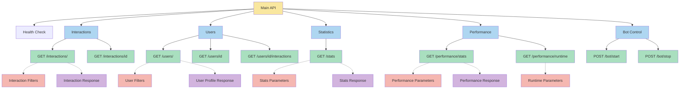

```mermaid
graph TD
    API[Main API] --> Health[Health Check]
    API --> Interactions[Interactions]
    API --> Users[Users]
    API --> Stats[Statistics]
    API --> Performance[Performance]
    API --> BotControl[Bot Control]
    
    Interactions --> ListInteractions[GET /interactions/]
    Interactions --> GetInteraction[GET /interactions/id]
    
    Users --> ListUsers[GET /users/]
    Users --> GetUser[GET /users/id]
    Users --> UserInteractions[GET /users/id/interactions]
    
    Stats --> GetStats[GET /stats]
    
    Performance --> PerfStats[GET /performance/stats]
    Performance --> Runtime[GET /performance/runtime]
    
    BotControl --> StartBot[POST /bot/start]
    BotControl --> StopBot[POST /bot/stop]
    
    ListInteractions -.-> IntFilters[Interaction Filters]
    ListUsers -.-> UserFilters[User Filters]
    GetStats -.-> StatsParams[Stats Parameters]
    PerfStats -.-> PerfParams[Performance Parameters]
    Runtime -.-> RuntimeParams[Runtime Parameters]
    
    ListInteractions -.-> InteractionResponse[Interaction Response]
    ListUsers -.-> UserProfileResponse[User Profile Response]
    GetStats -.-> StatsResponse[Stats Response]
    PerfStats -.-> PerformanceResponse[Performance Response]
    
    style API fill:#f9e79f
    style Interactions fill:#aed6f1
    style Users fill:#aed6f1
    style Stats fill:#aed6f1
    style Performance fill:#aed6f1
    style BotControl fill:#aed6f1
    
    style ListInteractions fill:#a9dfbf
    style GetInteraction fill:#a9dfbf
    style ListUsers fill:#a9dfbf
    style GetUser fill:#a9dfbf
    style UserInteractions fill:#a9dfbf
    style GetStats fill:#a9dfbf
    style PerfStats fill:#a9dfbf
    style Runtime fill:#a9dfbf
    style StartBot fill:#a9dfbf
    style StopBot fill:#a9dfbf
    
    style IntFilters fill:#f5b7b1
    style UserFilters fill:#f5b7b1
    style StatsParams fill:#f5b7b1
    style PerfParams fill:#f5b7b1
    style RuntimeParams fill:#f5b7b1
    
    style InteractionResponse fill:#d2b4de
    style UserProfileResponse fill:#d2b4de
    style StatsResponse fill:#d2b4de
    style PerformanceResponse fill:#d2b4de
```