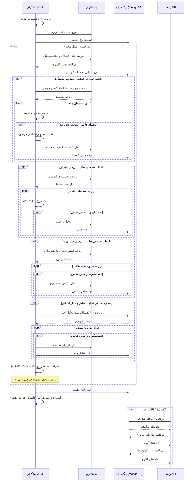

```mermaid
sequenceDiagram
    participant Bot as بات اینستاگرام
    participant Instagram as اینستاگرام
    participant DB as پایگاه داده (MongoDB)
    participant API as رابط API
    
    Bot->>Bot: راه‌اندازی و تنظیم پارامترها
    Bot->>Instagram: ورود به حساب کاربری
    Bot->>DB: ثبت شروع جلسه
    
    loop هر جلسه (طول متغیر)
        Bot->>Instagram: بررسی دنبال‌کنندگان و دنبال‌شوندگان
        Instagram-->>Bot: دریافت لیست کاربران
        Bot->>DB: به‌روزرسانی اطلاعات کاربران
        
        alt انتخاب تصادفی فعالیت: جستجوی هشتگ‌ها
            Bot->>Instagram: جستجوی پست‌ها با هشتگ‌های فارسی
            Instagram-->>Bot: دریافت پست‌ها
            
            loop برای پست‌های منتخب
                Bot->>Bot: بررسی محتوای فارسی
                alt محتوای فارسی تشخیص داده شد
                    Bot->>Bot: تحلیل محتوا و تشخیص موضوع
                    Bot->>Instagram: ارسال کامنت متناسب با موضوع
                    Bot->>DB: ثبت تعامل کامنت
                end
            end
        end
        
        alt انتخاب تصادفی فعالیت: بررسی تایم‌لاین
            Bot->>Instagram: دریافت پست‌های تایم‌لاین
            Instagram-->>Bot: لیست پست‌ها
            
            loop برای پست‌های منتخب
                Bot->>Bot: بررسی محتوای فارسی
                alt تصمیم‌گیری براساس شانس
                    Bot->>Instagram: تعامل با پست
                    Bot->>DB: ثبت تعامل
                end
            end
        end
        
        alt انتخاب تصادفی فعالیت: بررسی استوری‌ها
            Bot->>Instagram: دریافت استوری‌های دنبال‌شوندگان
            Instagram-->>Bot: لیست استوری‌ها
            
            loop برای استوری‌های منتخب
                alt تصمیم‌گیری براساس شانس
                    Bot->>Instagram: ارسال واکنش به استوری
                    Bot->>DB: ثبت تعامل واکنش
                end
            end
        end
        
        alt انتخاب تصادفی فعالیت: تعامل با دنبال‌کنندگان
            Bot->>DB: دریافت دنبال‌کنندگان بدون تعامل اخیر
            DB-->>Bot: لیست کاربران
            
            loop برای کاربران منتخب
                alt تصمیم‌گیری براساس شانس
                    Bot->>Instagram: ارسال پیام مستقیم
                    Bot->>DB: ثبت تعامل پیام
                end
            end
        end
        
        Bot->>Bot: استراحت تصادفی بین اکشن‌ها (15-60 ثانیه)
        
        Note over Bot: بررسی محدودیت‌های ساعتی و روزانه
    end
    
    Bot->>DB: ثبت پایان جلسه
    Bot->>Bot: استراحت تصادفی بین جلسات (15-30 دقیقه)
    
    par رابط API (همزمان)
        API->>DB: دریافت اطلاعات تعاملات
        DB-->>API: داده‌های تعاملات
        API->>DB: دریافت اطلاعات کاربران
        DB-->>API: داده‌های کاربران
        API->>DB: دریافت آمار و گزارشات
        DB-->>API: داده‌های آماری
    end
```