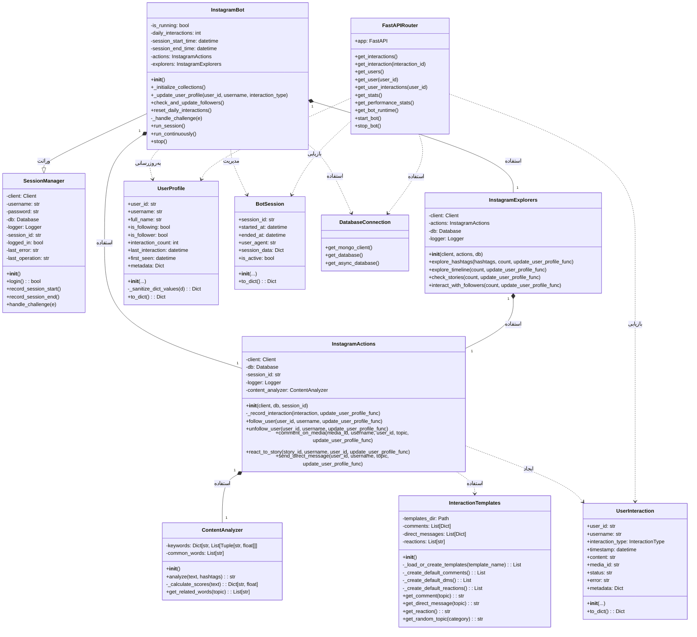

```mermaid
classDiagram
    class InstagramBot {
        -is_running: bool
        -daily_interactions: int
        -session_start_time: datetime
        -session_end_time: datetime
        -actions: InstagramActions
        -explorers: InstagramExplorers
        +__init__()
        +_initialize_collections()
        +_update_user_profile(user_id, username, interaction_type)
        +check_and_update_followers()
        +reset_daily_interactions()
        -_handle_challenge(e)
        +run_session()
        +run_continuously()
        +stop()
    }
    
    class SessionManager {
        -client: Client
        -username: str
        -password: str
        -db: Database
        -logger: Logger
        -session_id: str
        -logged_in: bool
        -last_error: str
        -last_operation: str
        +__init__()
        +login(): bool
        +record_session_start()
        +record_session_end()
        +handle_challenge(e)
    }
    
    class InstagramActions {
        -client: Client
        -db: Database
        -session_id: str
        -logger: Logger
        -content_analyzer: ContentAnalyzer
        +__init__(client, db, session_id)
        -_record_interaction(interaction, update_user_profile_func)
        +follow_user(user_id, username, update_user_profile_func)
        +unfollow_user(user_id, username, update_user_profile_func)
        +comment_on_media(media_id, username, user_id, topic, update_user_profile_func)
        +react_to_story(story_id, username, user_id, update_user_profile_func)
        +send_direct_message(user_id, username, topic, update_user_profile_func)
    }
    
    class InstagramExplorers {
        -client: Client
        -actions: InstagramActions
        -db: Database
        -logger: Logger
        +__init__(client, actions, db)
        +explore_hashtags(hashtags, count, update_user_profile_func)
        +explore_timeline(count, update_user_profile_func)
        +check_stories(count, update_user_profile_func)
        +interact_with_followers(count, update_user_profile_func)
    }
    
    class ContentAnalyzer {
        -keywords: Dict[str, List[Tuple[str, float]]]
        -common_words: List[str]
        +__init__()
        +analyze(text, hashtags): str
        -_calculate_scores(text): Dict[str, float]
        +get_related_words(topic): List[str]
    }
    
    class InteractionTemplates {
        -templates_dir: Path
        -comments: List[Dict]
        -direct_messages: List[Dict]
        -reactions: List[str]
        +__init__()
        -_load_or_create_templates(template_name): List
        -_create_default_comments(): List
        -_create_default_dms(): List
        -_create_default_reactions(): List
        +get_comment(topic): str
        +get_direct_message(topic): str
        +get_reaction(): str
        +get_random_topic(category): str
    }
    
    class UserInteraction {
        +user_id: str
        +username: str
        +interaction_type: InteractionType
        +timestamp: datetime
        +content: str
        +media_id: str
        +status: str
        +error: str
        +metadata: Dict
        +__init__(...)
        +to_dict(): Dict
    }
    
    class UserProfile {
        +user_id: str
        +username: str
        +full_name: str
        +is_following: bool
        +is_follower: bool
        +interaction_count: int
        +last_interaction: datetime
        +first_seen: datetime
        +metadata: Dict
        +__init__(...)
        -_sanitize_dict_values(d): Dict
        +to_dict(): Dict
    }
    
    class BotSession {
        +session_id: str
        +started_at: datetime
        +ended_at: datetime
        +user_agent: str
        +session_data: Dict
        +is_active: bool
        +__init__(...)
        +to_dict(): Dict
    }
    
    class FastAPIRouter {
        +app: FastAPI
        +get_interactions()
        +get_interaction(interaction_id)
        +get_users()
        +get_user(user_id)
        +get_user_interactions(user_id)
        +get_stats()
        +get_performance_stats()
        +get_bot_runtime()
        +start_bot()
        +stop_bot()
    }
    
    class DatabaseConnection {
        +get_mongo_client()
        +get_database()
        +get_async_database()
    }
    
    InstagramBot --|> SessionManager : وراثت
    InstagramBot "1" *-- "1" InstagramActions : استفاده
    InstagramBot "1" *-- "1" InstagramExplorers : استفاده
    InstagramActions "1" *-- "1" ContentAnalyzer : استفاده
    InstagramExplorers "1" *-- "1" InstagramActions : استفاده
    
    InstagramActions ..> InteractionTemplates : استفاده
    InstagramActions ..> UserInteraction : ایجاد
    InstagramBot ..> UserProfile : به‌روزرسانی
    InstagramBot ..> BotSession : مدیریت
    
    FastAPIRouter ..> UserInteraction : بازیابی
    FastAPIRouter ..> UserProfile : بازیابی
    FastAPIRouter ..> BotSession : بازیابی
    
    InstagramBot ..> DatabaseConnection : استفاده
    FastAPIRouter ..> DatabaseConnection : استفاده
```